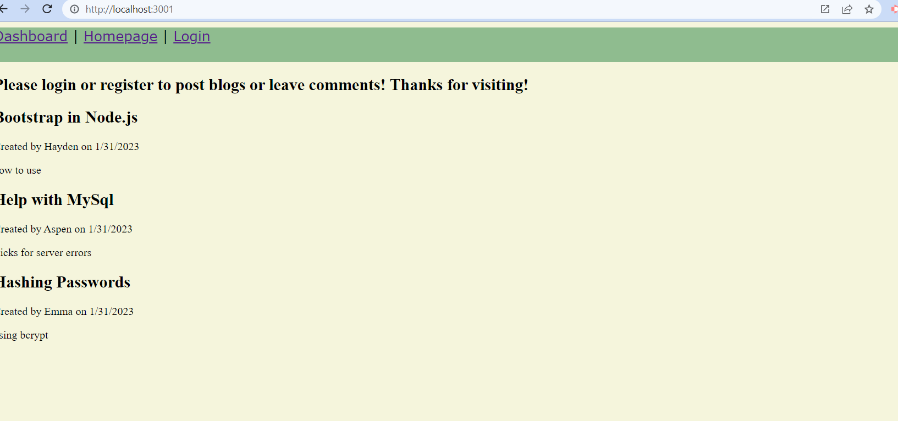
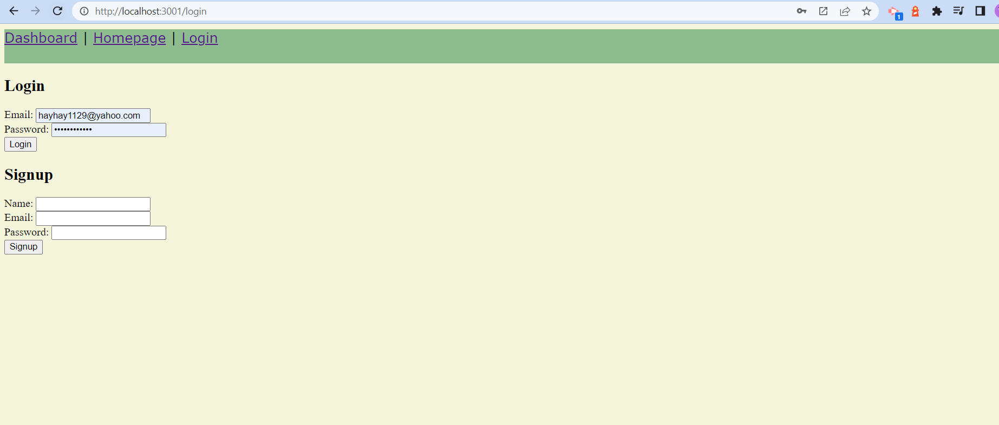
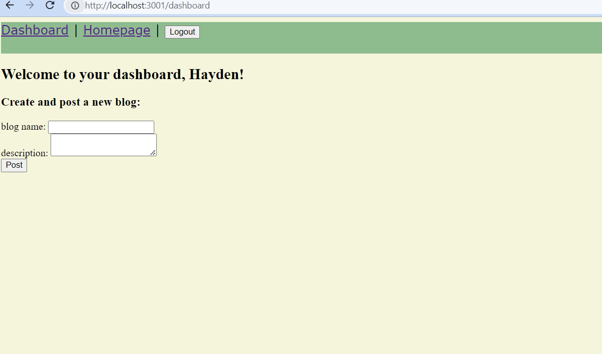

# TechBlog

## User Story
AS A developer who writes about tech
I WANT a CMS-style blog site
SO THAT I can publish articles, blog posts, and my thoughts and opinions

## Description
An application where the user can sign up or login and then create and post new blogs related to tech. 

### Technologies && Languages Used
HTML
CSS
Javascript
Bootstrap
Sequelize
MySQL2
Express.js
Node.js
Handlebars
Express-session/ Cookies
Bcrypt
Dotenv

### Installation && Usage
To start, run npm i in the integrated terminal, sign into mysql with credentials and run schema.sql to set up database, exit mysql and run npm start to open page on the browser.

### Screenshots

### Github Repo
(https://github.com/KarenAdkins84/TechBlog)

### Deployed Application

